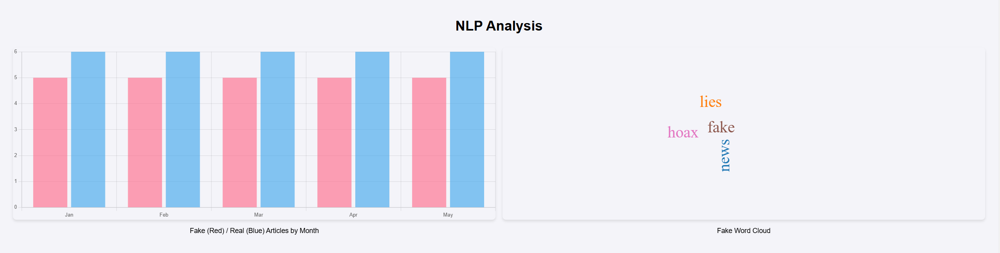

# Fake News Analyzer with Web Scraping and Machine Learning

## Overview

This project is a **Fake News Analyzer** that leverages **web scraping** and **machine learning** to identify and visualize fake news trends. The application consists of a Python backend and a React frontend, designed to scrape news articles, classify them as fake or real, and present the data in a visually appealing dashboard.



## Key Features

- **Web Scraping**: Utilized `BeautifulSoup` to scrape news headlines from BBC News.
- **Machine Learning**: Implemented a **Naive Bayes Classifier** to detect fake news using a labeled dataset.
- **Frontend Dashboard**: Built a React-based frontend to visualize:
  - Fake vs. Real news trends over months.
  - Word clouds for fake and real news keywords.
- **Backend Integration**: Flask backend to serve scraped and classified data to the React frontend.
- **Visualization**: Interactive bar charts and word clouds for detailed insights.

## What I Learned

### Technical Skills

- **Web Scraping**: Learned how to navigate website structures and handle challenges like dynamic content and headers.
- **Machine Learning**: Gained hands-on experience training and saving a model using `scikit-learn` and `joblib`.
- **React Development**: Improved my skills in creating dynamic user interfaces and handling API calls.
- **Data Visualization**: Used libraries like `react-chartjs-2` and `react-wordcloud` for interactive visuals.
- **Backend Development**: Built a robust REST API using Flask and handled CORS for seamless integration.

### Problem-Solving

- Debugging scraping issues due to changes in website structure.
- Fixing frontend errors like `ResizeObserver loop` to improve user experience.
- Ensuring compatibility between Python and JavaScript components.

### Soft Skills

- **Attention to Detail**: Ensured the frontend and backend were seamlessly integrated.
- **Adaptability**: Overcame challenges like dataset preprocessing and dynamic website scraping.
- **Communication**: Documented the codebase for clarity and collaboration.

## How It Works

1. **Backend**:

   - Scrapes headlines from BBC News.
   - Classifies them using a pre-trained machine learning model.
   - Serves the data to the frontend via API.

2. **Frontend**:

   - Fetches data from the backend.
   - Displays bar charts and word clouds for visual analysis.

## How to Run

### Backend

1. Navigate to the backend folder:
   ```bash
   cd backend
   ```
2. Install dependencies:
   ```bash
   pip install -r requirements.txt
   ```
3. Run the server:
   ```bash
   python app.py
   ```

### Frontend

1. Navigate to the frontend folder:
   ```bash
   cd frontend
   ```
2. Install dependencies:
   ```bash
   npm install
   ```
3. Start the React application:
   ```bash
   npm start
   ```

## Technologies Used

- **Frontend**: React, Chart.js, React Wordcloud, Tailwind CSS.
- **Backend**: Flask, BeautifulSoup, Scikit-learn.
- **Tools**: Python, JavaScript, Node.js.

## Future Enhancements

- Add sentiment analysis for classified headlines.
- Expand scraping sources to include more news platforms.
- Enhance the machine learning model with deep learning techniques.

## Dashboard

The dashboard includes:

- A bar chart showing trends of fake vs. real articles.
- Word clouds for fake and real news.


## Conclusion

This project demonstrates my ability to build full-stack applications that integrate machine learning, web scraping, and data visualization. It highlights my problem-solving skills and adaptability, making me a strong candidate for roles requiring expertise in data science, machine learning, and frontend-backend integration
